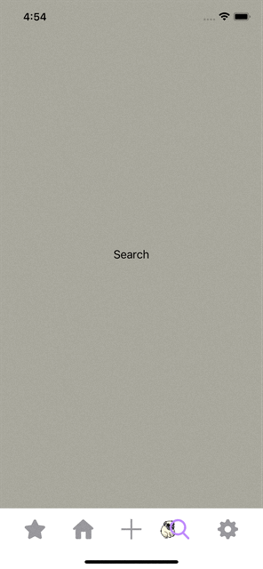
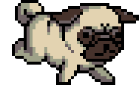
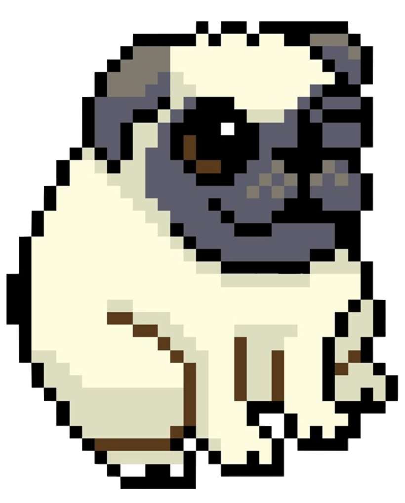

# MonsterJump (Custom Tabbar)

MonsterJump,a tabbar with a dog(Pixel Pug) jumping on it, inspired by the tutorials by [Kavsoft](https://www.youtube.com/channel/UCsuV4MRk_aB291SrchUVb4w), fully developed with SwiftUI.

# Menu
* [Screenshots](#screenshots)
* [Features](#features)
* [To-Do](#to-do)
* [Source](#source)
* [Contributions](#contributions)
* [Contact](#contact)

# Screenshots

 

# Features

* Custom Tabbar
* Animated Pixel Pug!

### To-Do
* More natural animation.
* Pixel Pug direction changing when selecting tabs back and forth.

# Source
The tutorial: [Kavsoft](https://www.youtube.com/channel/UCsuV4MRk_aB291SrchUVb4w), fully developed with SwiftUI.

Pixel Pug [GIF](https://tenor.com/view/pug-run-pixel-transparent-dog-gif-15586664)

 

[Sitting Pixel Pug](https://www.nicepng.com/ourpic/u2y3a9u2a9y3q8a9_pixel-pug-pugs-puppydogpals-puppydogpalsrolly-master-pokeball/)

 

# Contributions

* All kinds of contributions (enhancements, new features, documentation & code improvements, issues & bugs reporting & todo task) are welcome. Let's make it better.

# Contact
Created by [Terry Kuo](https://twitter.com/ArgonYoYo) - feel free to contact me!
